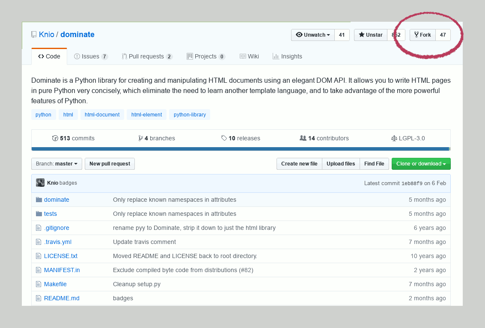

How to send a Pull Request on GitHub
====================================

By Cloning the Original Project
--------------------------------------------------------------------------------

### Clone (download) the reposoitory that you wish to contribute to.

(Replace `$username` and `$repo` with appropriate values for the original
project)

    $ git clone git@github.com:$username/$repo.git
    $ cd $repo

### Fork the project on GitHub

### Update git remotes

Remotes are addresses of externally-hosted git repositories. They are
referenced by names.

From your cloned copy, rename your "origin" remote to "upstream":

    $ git remote rename origin upstream

And add your fork repository on GitHub as your new origin:

    git remote add origin git@github.com:$username/$repo.git

By Cloning your Fork
--------------------------------------------------------------------------------

### Fork the project on GitHub, and Clone (download) your fork

(Replace `$username` and `$repo` with appropriate values for your fork)

    $ git clone git@github.com:$username/$repo.git
    $ cd $repo

### Update git remotes

Remotes are addresses of externally-hosted git repositories. They are
referenced by names.

From your fork, add an "upstream" remote pointing back to the original project.

    git remote add upstream git@github.com:$username/$repo.git

Making Changes
--------------------------------------------------------------------------------

### Create a new branch to work on

You don't want to work on the master branch, otherwise every commit you ever
add to that branch in future will also be added to your pull request.

    $ git branch $branch
    $ git checkout $branch

Or, in one command:

    $ git checkout -b $branch

If you have more than one pull request to make, you should return to the "master"
branch before creating a new branch.

    $ git checkout master
    $ git checkout -b $another_branch

### Commit your changes from your branch

e.g. `git add`, `git commit` as normal.

### Push (upload) the changes to your fork's GitHub remote

    $ git push origin $branch

Tidying Up by Squashing Commits
--------------------------------------------------------------------------------

You may have made many commits. It can sometimes be helpful to combine them
into a single commit by "squashing" them.

Review your commits with `git log` (press `q` to quit).

Select the last `N` commits, where N is a number of commits (e.g. `3`):

    $ git rebase -i HEAD~N

You'll see something to edit looking like this:

    pick c628332 Suppress rendering of boolean attributes when the value is False
    pick abcd123 Fix whitespace
    pick 123beef Fix typo in comment

Squash minor commits by editing as follows:

    pick c628332 Suppress rendering of boolean attributes when the value is False
    squash abcd123 Fix whitespace
    squash 123beef Fix typo in comment

Once saved, you'll have a chance to edit the commit messages. You'll see
something like this:

    # This is a combination of 4 commits.
    # The first commit's message is:
    Suppress rendering of boolean attributes when the value is False

    # This is the 2nd commit message:

    Fix whitespace

    # This is the 3rd commit message:

    Fix typo in comment

Trim down the message, perhaps by simply deleting trivial commit messages, e.g.:

    Suppress rendering of boolean attributes when the value is False

If you've already pushed these commits to a remote, you'll have to forcefully
communicate these changes. Try not to squash commits after pushing because
this will cause trouble for anyone who has already pulled your changes. But if
you're sure you can get away with it, this can be done:

    git push origin +$branch

(Replace `$branch` with the branch name)

Communicating Changes
--------------------------------------------------------------------------------

### Make a Pull Request

The GitHub website will automatically prompt you to make a pull request.

You can also do this by going to your fork's branches on the GitHub website,
and making a pull request from a specific branch.

After your Pull Request is Accepted
--------------------------------------------------------------------------------

If your pull request is accepted then it will be merged with the upstream repo.

If you're not done making changes, you'll want to update your local copy with:

    $ git pull upstream master
    $ git push origin master

It's up to you if you want to delete your old branch at this point.

    $ git branch -d <branch name> # delete locally
    $ git push --delete origin $branch # delete on your fork remote

However, it may be useful to keep your old branch as a record.

---

Copyright © 2019 the author(s):

    * Ben Golightly \<golightly.ben@googlemail.com\>

This text is provided "as is" and without any express or implied warranties.
Copying and distribution of this text, with or without modification, are
permitted in any medium without royalty provided this notice is preserved.

